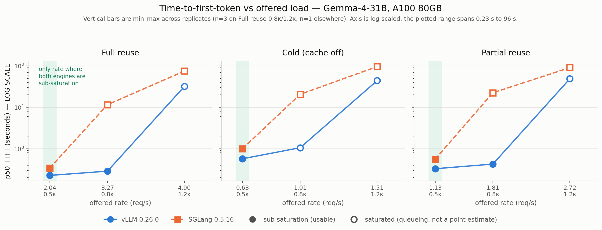
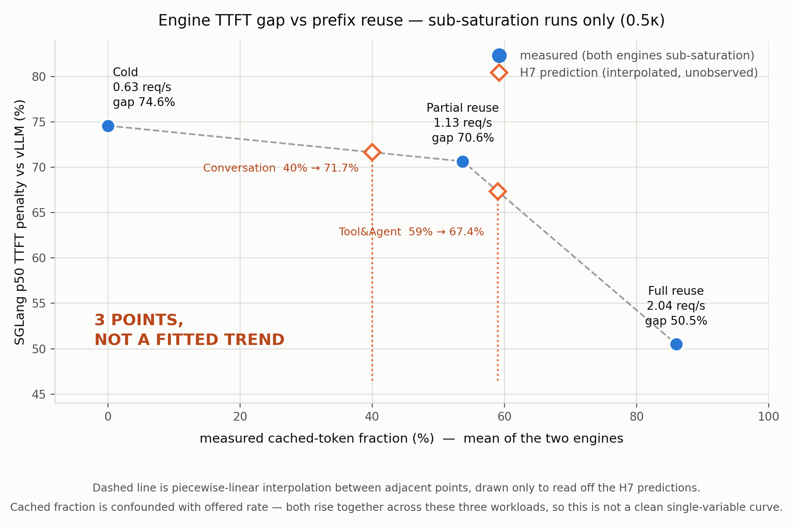

# Does prefix reuse change which serving engine wins?

**vLLM 0.26.0 vs SGLang 0.5.16 under multimodal prefix sharing.** One model
(`google/gemma-4-31B-it`), one A100 80GB, one day, pre-registered before the
first measured run.

The design, hypotheses, and thresholds are frozen in
[`spec/SPEC.md`](spec/SPEC.md) and were not edited after the P2 commit; every
later amendment is a dated, stated-reason blockquote in the phase runbook it
affects. Results land in later commits only.

---

## Answer, in one paragraph

**No — prefix reuse does not change which engine wins, but it does change by how
much.** vLLM had lower p50 TTFT at every comparison point where both engines
were genuinely sub-saturation, by 50–82%. The pre-registered expectation (H1)
was the opposite: SGLang's token-granular RadixAttention was predicted to beat
vLLM's 16-token block matching under full reuse. It did not, at any reuse level.
What reuse *does* change is the size of the gap, which shrinks monotonically as
the cached fraction rises — 74.6% at 0% cached, 70.6% at 54%, 50.5% at 86%.
Cache **matching granularity is ruled out** as the mechanism: the two engines'
measured cached-token fractions differ by only 1.3–1.4 points. A text-only
control attributes roughly a third of the Full-reuse gap to the multimodal
prefill path and the rest to a general first-token overhead that has nothing to
do with images or with caching.

The single most consequential methodological result is separate: **the
pre-registered rate grid did not survive contact with real load.** Of 28 core
runs, 16 were in queueing collapse while reporting a perfect completion ratio.
Only the lowest of three rates is a usable comparison point, so this study
answers its question at one load level, not the three it planned for.

---

## What ran

| | |
|---|---|
| Model | `google/gemma-4-31B-it`, bf16, `max_model_len=8192`, one A100 80GB |
| Engines | `vllm==0.26.0`, `sglang==0.5.16` — never co-resident (two ~60 GB weight sets do not fit 80 GB) |
| Input budget | ~1010 tokens/request, identical across Full reuse / Cold / Partial reuse |
| Image | fixed 448×448 → **258 tokens at every resolution** (Gemma 4 is not a dynamic-resolution ViT) |
| Output budget | `max_tokens=128, ignore_eos=true` (Single stream: 512) |
| Arrivals | open-loop Poisson, rates `{0.5κ, 0.8κ, 1.2κ}` with `κ = min(κ_vllm, κ_sglang)` per workload |
| Warmup | 50 requests discarded per run |
| Core matrix | 28 runs; plus a 12-run text-only control and a late-pass n=3 variance block |

Per-workload results, request files, raw per-request JSON, and pre/post
Prometheus scrapes live in each workload's own folder:
[full-reuse](workloads/full-reuse/) · [cold](workloads/cold/) ·
[partial-reuse](workloads/partial-reuse/) ·
[single-stream](workloads/single-stream/) ·
[full-reuse-text](workloads/full-reuse-text/) ·
[partial-reuse-text](workloads/partial-reuse-text/)

**Workload validity gate passed.** [SPEC §6](spec/SPEC.md#6-measurement-contract)
requires Full reuse's measured cacheable fraction to sit within ±5 pts of the
constructed 87.5%, and Cold's to read ≈0. Measured: Full reuse 85.4% (vLLM) /
86.7% (SGLang); Cold 0.0% on both. Partial reuse measured 53.0% / 54.4% against
a constructed 30–80% span.

---

## Figures



**Read the fill, not just the line.** Solid markers passed both saturation
checks; hollow markers are in queueing collapse and are not point estimates.
A comparison is only legitimate where *both* engines are solid — which is the
shaded leftmost rate, and nowhere else. The vertical axis is log-scaled because
the plotted range spans 0.23 s to 96 s; on a linear axis the entire healthy
region where the actual result lives collapses onto the floor.



Three points, plotted as three points. The dashed line is piecewise-linear
interpolation between adjacent measurements, drawn for one purpose only — to
read off the H7 predictions below — and is explicitly labelled on the figure as
not a fitted trend. Note the confound stated on the figure: because `κ` differs
per workload, cached fraction and absolute offered rate rise together across
these three points, so this is not a clean single-variable curve.

---

## Results

Two null categories are used throughout, and they are **not**
interchangeable ([SPEC §3](spec/SPEC.md#3-hypotheses-frozen-at-the-p2-commit)):

- **null (measured)** — measured at a clean comparison point, no effect found.
  A real result.
- **null (no clean point)** — no comparison point survived saturation. This
  says something about how tightly a coarse pilot sweep can calibrate a shared
  rate grid; it says *nothing* about cache behaviour.

| ID | Prediction | Verdict | Measured |
|----|-----------|---------|----------|
| **H1** | Full reuse: SGLang p50 TTFT ≥20% **lower** than vLLM | **falsified** (sign reversed) | SGLang **+50.5%** at `0.5κ` (0.341 s vs 0.227 s). `0.8κ`/`1.2κ` contribute nothing — null (no clean point). |
| **H2** | Cold: engines within 10% on p50 TTFT | **falsified** | **74.6%** apart at `0.5κ` (1.000 s vs 0.573 s) |
| **H3** | Output-throughput ranking unchanged by prefix condition | **confirmed (ordinal only)** | vLLM ≥ SGLang in all three prefix conditions at both saturated rates; ranking never inverts. At `0.5κ` both engines deliver the offered rate exactly (219.3 vs 219.3 tok/s), so the ranking is *not resolvable* at the clean point — this verdict rests entirely on the ordinal-only overload data [SPEC §6](spec/SPEC.md#6-measurement-contract) permits for exactly this kind of claim. |
| **H4a** | Partial reuse: cached-token fraction differs <5 pts between engines | **confirmed** | **1.4 pts** (vLLM 53.0%, SGLang 54.4%) at `0.5κ`. See the instrument note below. |
| **H4b** | Partial-reuse gap exceeding Full-reuse gap appears **only** at mid/high rate | **falsified** | Present at the *low* rate: Partial **70.6%** > Full **50.5%** at `0.5κ` |
| **H5** | Single stream: engines within 10% on p50 ITL | **confirmed** | **0.07%** apart (42.4 ms vs 42.5 ms) — while TTFT at the same concurrency differs by 82% |
| **H6** | VisionArena replay: engines within 10% p50 TTFT, cached fraction <10% | **not run** | P6 blocked on GPU capacity. Not a null of either category. |
| **H7** | Mooncake replay predicted by the synthetic curve within ±10 pts; Tool&Agent gap ≥ Conversation gap | **not run — predictions committed below** | Clause 2 is *already contradicted* by the day-1 curve; see the H7 bullet. |

**Fewer nulls than P4 anticipated, for a stateable reason.**
[P4](spec/phases/P4-writeup.md) expected several of H1/H4a/H4b to land in the
"no clean point" category. They did not. H1 and H4b resolved because `0.5κ`
survived as a clean point on every workload, and **H4a resolved only because
vLLM's missing per-request cached-token field turned out to be recoverable from
its Prometheus counters** (below). Had that recovery failed, H4a would have been
unmeasurable on one engine — not a null of either category, but a third thing
again. The second null category therefore applies here to *rate levels*
(`0.8κ`, `1.2κ`) rather than to whole hypotheses.

**Why thresholds are interpretable at `0.5κ` despite n=1 there.**
[SPEC §6](spec/SPEC.md#6-measurement-contract) permits interpreting a threshold
only if measured replicate spread is under half that threshold. The core-matrix
`0.5κ` cells are n=1, but the text-only control ran n=3 per engine at the same
`0.5κ` rates and gives the missing variance estimate for sub-saturation cells:
spread 0.8–1.9%, CV 0.4–0.9%. Every gap above is at least 25× that spread. The
`0.8κ` variance block is *not* usable for this purpose — see the queueing bullet.

**p99 is not reported anywhere.** [SPEC §6](spec/SPEC.md#6-measurement-contract)
requires ≥500 completions for a reportable p99. Only 14 runs clear that bar and
**every one of them is a saturated cell** — p99 is reportable exactly where the
latency number is meaningless, and unreportable at every clean point. This is a
design flaw in the run-length choice, not a finding.

### Cross-engine cached fraction — how it was measured

`scripts/client.py` records `cached_tokens` only when the engine returns it
per-request. SGLang does; vLLM 0.26.0 does not, so every vLLM run carries
`measured_cached_fraction: null`. **That is an instrument gap, not a cache gap** —
vLLM publishes the same quantity as Prometheus counters
(`prefix_cache_hits_total / prefix_cache_queries_total`). Because `run.sh`
scrapes pre and post, the delta is per-run.

The method is validated on the engine where *both* instruments exist: SGLang's
per-request field and its `cached_tokens_total` counter agree to **≤0.2 pts** on
every run. `scripts/extract_p4.py` recovers both engines' fractions this way;
H4a's verdict depends on it.

---

## Gate B — what the multimodal path actually caches

Gate B replays one identical request twice and reports `ttft2/ttft1`:
**vLLM 0.661, SGLang 0.765** ([raw](gates/vllm/gate_b_result.json),
[raw](gates/sglang/gate_b_result.json)).

The pre-registered reading of a partial drop was "one cache layer only — KV
without the vision tower, or the reverse." **The counters do not support that
reading and it is withdrawn.** On the second request vLLM hit 992 of 1010 prompt
tokens (98.2%) and SGLang 1008 of 1009 (99.9%) — near-total KV reuse producing
only a 34% / 23% TTFT reduction. Separately, on the reuse workloads vLLM's
multimodal processor cache hits **99.6–100%** (`mm_cache_hits_total`) *while* its
KV prefix cache hits 85% — both layers are live simultaneously.

So the residual TTFT after a near-total cache hit is **fixed per-request cost** —
scheduling, tokenization, sampling, the uncached tail, kernel launch — not an
uncached vision tower. This matters because it sets a floor: no amount of prefix
reuse drives TTFT toward zero on either engine, which is exactly what the
gap-vs-cached-fraction curve shows flattening out.

*Caveat:* SGLang exposes no multimodal-cache counter, so the two-layer
demonstration is vLLM-only. For SGLang the image tokens sit inside a cached
prefix region far larger than the image itself (86.7% of ~1010 tokens vs 258
image tokens), so its image-token KV is demonstrably reused whether or not it
keeps a separate embedding cache.

## Mechanism — a three-way fork, adjudicated by counters

Not "cache-effect assumed, graphs checked as a footnote."

**(a) Cache matching granularity — ruled out, quantitatively.** vLLM matches on
16-token blocks, SGLang on single tokens, so vLLM should lose up to
`block_size − 1 = 15` tokens at the divergence point. Measured, that is exactly
what happens and it is exactly as small as
[SPEC §3](spec/SPEC.md#3-hypotheses-frozen-at-the-p2-commit) predicted: the
engines' cached fractions differ by **1.3 pts on Full reuse and 1.4 pts on
Partial reuse** — 13–14 tokens out of ~1010, consistent with a mean loss of 8
and a max of 15. Against absolute gaps of 114 ms (Full) and 232 ms (Partial),
a dozen tokens of extra prefill is single-digit milliseconds. Granularity is
real, measurable, and far too small to be the mechanism.

**(b) The multimodal prefill path — real, and about a third of it.** SGLang logs
`Breakable CUDA graph is incompatible with multimodal model; disabling prefill
CUDA graph` and captures decode-only graphs (bs 1–256); vLLM captures
`FULL_AND_PIECEWISE` over 51 piecewise and 35 full batch shapes covering prefill
([evidence](learnings/infrastructure/cuda-graphs.md)). Both engines
independently chose Triton for attention, so the kernel is not the difference.
The text-only control sizes this directly by removing every image token:

| Workload | Gap, multimodal | Gap, text-only | Multimodal-specific |
|---|---|---|---|
| Full reuse | 50.5% | **33.0%** | 17.5 pts (35% of the gap) |
| Partial reuse | 70.6% | **60.2%** | 10.4 pts (15% of the gap) |

n=3 per engine per cell, `completion_ratio: 1.0` on all 12,
[full](workloads/full-reuse-text/README.md) ·
[partial](workloads/partial-reuse-text/README.md).

**(c) A general first-token overhead — the remainder, and the larger share.**
33.0 and 60.2 points of gap survive with *zero* image tokens. The cleanest
isolation is Single stream: at **concurrency 1**, with no queue to schedule and
one request in flight, vLLM reaches first token in 138 ms and SGLang in 251 ms —
an 82% gap — while ITL is identical to 0.07%. Decode is the same engine-to-engine;
everything is in the path to the first token; and because nothing is queued,
*cache-aware scheduling cannot be the explanation there at all*.

**Verdict: a split, not a winner.** (a) is dead. (b) is real, independently
interesting — a genuine difference in multimodal prefill handling with nothing
to do with prefix reuse — and accounts for roughly a third of the Full-reuse
gap. (c) is the majority and is present at zero concurrency and zero images.
The text-only control is what makes the split visible instead of assumed.

## What the saturated runs show — queueing, not slowness

Sixteen of 28 core cells were retagged `saturated` *after* collection by a
second signal, `ttft_growth_ratio` (median TTFT of a run's second half over its
first, threshold 2.0). No cell needed re-running; only its classification was
wrong ([detail](learnings/measurement/ttft-growth-signal.md)). Completion ratio
— the original and only check — sat at a perfect 1.00 on all of them. The engine
did finish every request. It just finished them arbitrarily late, which is
[SPEC §6](spec/SPEC.md#6-measurement-contract)'s own definition of saturation and
something a completion count structurally cannot see.

The late-pass variance block makes the case concretely. Full reuse at `0.8κ`,
n=3 on both engines, same rate, same workload, alternating engine order:

| Engine | p50 TTFT, three reps | Spread | TTFT growth | Completion |
|---|---|---|---|---|
| vLLM | 0.285 / 0.288 / 0.289 s | **1.3%** | 1.06–1.07 | 1.00 |
| SGLang | 10.44 / 11.86 / 12.51 s | **19.8%** | 3.95–4.49 | 1.00 |

SGLang at `0.8κ` is not "40× slower than vLLM" — it is in a different regime,
where the number you get is a function of how long you ran. A 20% spread across
identical repeats at what the design intended as a healthy rate is itself the
argument: near-knee measurement is *unstable*, not merely slower. That is why
`0.8κ` is reclassified from a comparison point to an asymmetric-saturation
observation, and why it cannot supply the variance estimate for H1's threshold.

The asymmetry is the interesting part. At `0.8κ` SGLang has collapsed on Full
reuse and Partial reuse while vLLM is still clean at 1.3% spread; on Cold both
have collapsed. A TTFT delta measured there is dominated by which side of its own
knee each engine sits on — precisely the confound this design exists to exclude.

## H7 prediction commit

Read off [`figures/gap.png`](figures/gap.png) **before any Mooncake replay
runs**. Prediction and observation live in separate commits; this is the
non-negotiable ordering ([P6](spec/phases/P6-last-experiment.md)).

| Mooncake trace | Known reuse ratio | **Predicted SGLang TTFT penalty vs vLLM** |
|---|---|---|
| Conversation | 40% | **71.7%** |
| Tool & Agent | 59% | **67.4%** |

**Stated load regime — the prediction is void outside it.** Both numbers are
interpolated between points measured at `0.5κ`, the only rate where both engines
stayed sub-saturation, at absolute offered rates of 0.63 / 1.13 / 2.04 req/s
across the three anchor workloads — i.e. offered load at roughly half the
*smaller* engine's saturation knee. If a replay's own offered load lands near or
past either engine's knee, a miss is attributable to the load regime rather than
to the cache model, and per [P6](spec/phases/P6-last-experiment.md)'s saturation
gate that attribution must be stated, not left ambiguous.

**H7's second clause is already contradicted, and this is recorded before the
run rather than after.** H7 predicts `Tool&Agent gap ≥ Conversation gap`. The
measured day-1 curve is monotonically *decreasing* in cached fraction, so it
predicts the opposite ordering — 67.4% < 71.7%. Unless the replay reverses the
sign of the relationship, H7 fails on clause 2 regardless of how clause 1 lands.

**Both numbers carry the figure's own caveat.** They are interpolated between
three points whose cached fraction is confounded with offered rate, using
piecewise-linear interpolation between adjacent measurements because a global
fit over three points would be arithmetic theatre. Conversation's 40% sits
between the Cold (0%) and Partial (54%) anchors; Tool&Agent's 59% sits just past
Partial, on the steep segment toward Full reuse.

---

## Future work

Two workloads from [P5](spec/phases/P5-stretch.md)'s original priority order are
not run this cycle and are recorded here as dated future work, not silently
dropped. Neither was attempted; both are stated as of **2026-08-09**.

- **Branching reuse** (8 images × 12 questions, interleaved — tree-shaped reuse
  rather than the linear reuse the core four test) — not run as of this
  writeup. No harness blocker; deferred purely for schedule reasons once P5's
  entry condition failed.
- **Multi-turn chat** (4-turn conversations, full-history resend — growing
  self-reuse within a session) — not run as of this writeup, and unlike
  branching reuse this one has a real prerequisite: **the day-1 harness has no
  conversation-state support**, so this needs new, unvalidated harness work
  before it can run at all. Flagged in P5 as the highest schedule risk of the
  four original stretch items; that risk is exactly why it is deferred rather
  than rushed.

Cache thrash is not listed here because it is not deferred — it is subsumed. The
Mooncake replay ([P6](spec/phases/P6-last-experiment.md)) is a strictly better
version of the same eviction question, run against a real working set instead of
a Zipf synthetic.

## Known limitations

N=1 hardware, one model, one day; synthetic noise images (encoder cost is
content-independent, but real traffic has correlated prefix structure this
workload only approximates); open-loop Poisson arrivals (addressed on day 2 by
the Mooncake replay's preserved trace timestamps); p99 underpowered at n=200;
engine scheduler defaults recorded, not swept; **the shared rate grid's `0.8κ`
point, calibrated from a coarse pilot sweep, did not survive as a clean
sub-saturation comparison for most workloads — the real comparison is narrower
than pre-registered** ([SPEC §3](spec/SPEC.md#3-hypotheses-frozen-at-the-p2-commit)).
This list is the difference between a benchmark and a blog post.

Three further limitations were found while writing this up, and are recorded
here rather than folded silently into the text above:

- **The Cold baseline is only genuinely cold at `0.5κ` for vLLM.**
  `--no-enable-prefix-caching` disables the KV prefix cache (verified:
  `prefix_cache_queries_total` stays 0 across all three Cold runs) but does
  **not** disable vLLM's multimodal processor cache. Because servers were not
  restarted between rate cells within a workload block, that cache stayed warm
  from the preceding cell: Cold multimodal hit rate was 0% at `0.5κ`, **100% at
  `0.8κ`, and 71.4% at `1.2κ`**. Cold at `0.8κ`/`1.2κ` was therefore running a
  cached vision path on one engine only. Both cells were already excluded as
  saturated, so no reported comparison is affected — but the flag does not mean
  what its name implies, and a study that leaned on Cold at a higher rate would
  have been silently wrong.
- **Cross-engine cached fractions come from two different instruments**
  (per-request field on SGLang, Prometheus counter delta on vLLM), cross-validated
  to ≤0.2 pts on the engine exposing both. H4a's verdict rests on that
  cross-validation rather than on a single common instrument.
- **GPU clocks could not be locked from inside the container** (no permission),
  so thermal drift is uncontrolled — mitigated only by engine-order alternation
  and the late-pass variance block, never eliminated. Clocks, temperature, and
  power are logged alongside every scrape for post-hoc checking.

---

## Reproducing

```bash
./run.sh bootstrap          # venvs, weights, workload build (re-run after any pod resume)
./run.sh up vllm            # start an engine
./run.sh cell full-reuse vllm 0.5k
./run.sh p3                 # the whole core matrix
python scripts/extract_p4.py    # run table + cached fractions from the scrapes
python scripts/analyze_p4.py    # every number quoted above
python scripts/make_figures.py  # figures/ttft.png, figures/gap.png
```

Note for any future pod resume: RunPod stop/resume wipes the container disk
(venvs, apt packages; the network volume survives). `ninja-build` must be
reinstalled via apt — it is an undeclared dependency in both engines' pip
metadata.

## Repo map

| Path | What's in it |
|---|---|
| [`spec/SPEC.md`](spec/SPEC.md) | Frozen pre-registration: question, H1–H7, workload definitions, measurement contract |
| [`spec/phases/`](spec/phases/) | P0–P6 runbooks; all post-freeze amendments are stated-reason blockquotes here |
| [`workloads/`](workloads/) | One folder per experiment: requests, raw results, metrics scrapes, generated README |
| [`gates/`](gates/) | P1 measurement-validation artifacts: Gate B/C results, config dumps, CUDA-graph capture logs |
| [`learnings/`](LEARNINGS.md) | 13 topical modules on what broke and what it taught — indexed in `LEARNINGS.md` |
| [`figures/`](figures/) | The two figures above |
| `run.sh` | Orchestration: bootstrap, server lifecycle, cells, the full matrix |
| `scripts/` | `client.py` (load generator), `pilot.py` (κ finder), `render_readme.py`, and the P4 analysis chain |

Gate A (strict output-equivalence) was tried and **dropped as a blocker**: it
tests a property no latency comparison needs, and it manufactured a false engine
asymmetry out of bf16 reduction-order noise. Replaced by Gate R
(reuse-by-counters + budget pinning + shape matching). The full account is in
[`learnings/gate-a/`](learnings/gate-a/) — it is the most useful negative result
in the repo.
