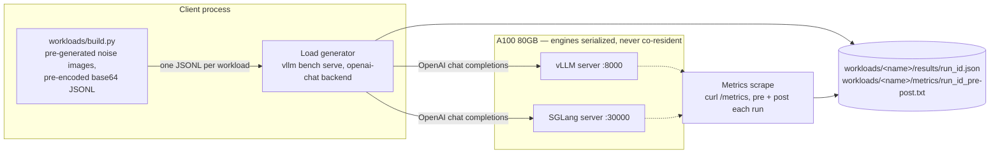
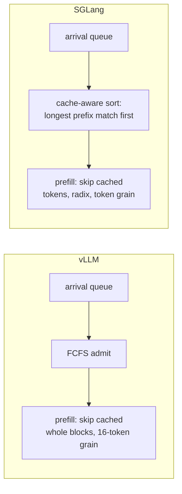

# Does prefix reuse change which serving engine wins?

vLLM vs SGLang under multimodal prefix sharing. One model, one A100, one day
(plus a pre-registered day-2 epilogue).

**This file is the frozen pre-registration**: question, hypotheses, workload
definitions, and measurement contracts. The `phases/` directory contains the
operational runbooks. Everything is committed together at the end of
[P2](phases/P2-freeze.md), before the first matrix run; hypotheses and
thresholds are unedited after that commit; results land in later commits only.

```
spec/
  SPEC.md                       ← you are here: the frozen design
  phases/
    P0-feasibility.md           environment, model lock, workload build
    P1-gates.md                 measurement validation
    P2-freeze.md                commit, pilots, rates
    P3-core-matrix.md           the 22 runs
    P4-writeup.md               figures, results, H7 prediction commit
    P5-stretch.md               conditional extras
    P6-last-experiment.md       VisionArena replay, Mooncake replay
```

---

## 1. Question

vLLM and SGLang both cache prefix KV, but differently — vLLM uses hash-keyed
block-level automatic prefix caching (default block: 16 tokens); SGLang uses
RadixAttention, a token-granular radix tree with cache-aware scheduling.
Multimodal traffic is the sharpest available probe: one shared image expands to
hundreds of prefill tokens, so a shared image is a large shared prefix.

**Question:** under partial and full prefix reuse, do the engines diverge on
TTFT — and if so, is the mechanism cache *matching granularity*, cache-aware
*scheduling*, or a difference in what the *multimodal path* caches at all?

That three-way attribution is the point. A raw "X was faster" number is not a
finding.

## 2. System under test



Engines are never co-resident: two ~60 GB weight sets do not fit one 80 GB card.
Server lifecycle is scripted in `run.sh`; restart between workloads, alternate
which engine goes first per workload block (see [P3](phases/P3-core-matrix.md)).

## 3. Hypotheses (frozen at the P2 commit)

> **Amended after the real P3 matrix ran — the comparison design at `0.8κ`
> did not survive contact with real load, and the hypotheses below must be
> read against the corrected comparison points, not the originally intended
> ones.** Full detail, the retag that found it, and the exact rates affected
> in [`../learnings/measurement/ttft-growth-signal.md`](../learnings/measurement/ttft-growth-signal.md).
> Summary: the shared grid `κ = min(κ_vllm, κ_sglang)` was meant to put
> `0.8κ` safely sub-saturation for *both* engines. It doesn't. Measured on
> the real matrix:
>
> | Workload | Clean (both engines healthy) | `0.8κ` status |
> |---|---|---|
> | Full reuse | **`0.5κ` only** | SGLang saturated (3 reps, 10.4–12.5s p50); vLLM clean |
> | Partial reuse | **`0.5κ` only** | SGLang saturated; vLLM clean |
> | Cold | **`0.5κ` only** | **Both engines saturated** |
>
> At `0.8κ`, a TTFT delta is no longer attributable to cache behaviour — it is
> dominated by *which side of its own knee* each engine happens to sit on,
> exactly the confound this design exists to exclude. **`0.8κ` is
> reclassified from a comparison point to an asymmetric-saturation
> observation.** `0.5κ` is the only rate where H1, H4a/H4b, and gap.png's
> cross-engine deltas are valid for Full reuse, Partial reuse, and Cold. `1.2κ`
> keeps its original role (explicit overload probe, ordinal-only, never a
> point estimate — [§6](#6-measurement-contract)).
>
> This also promotes a second explanation to equal standing with cache
> behaviour, not a footnote to rule out first: SGLang disables CUDA-graph
> capture for prefill on this multimodal model, vLLM does not
> ([`../learnings/infrastructure/cuda-graphs.md`](../learnings/infrastructure/cuda-graphs.md)).
> If SGLang collapses at `0.8κ` on Full reuse while vLLM does not, "one engine
> pays un-graphed prefill overhead the other doesn't" explains a TTFT gap with
> zero reference to prefix reuse at all. Cache-effect and graph-effect are
> **competing primary hypotheses**, adjudicated by the counters already
> collected (cached-token fraction, preemption counts, `cuda_graph_info.txt`)
> — not sequential checks where caching is assumed and graphs are checked only
> if caching looks insufficient. See [P4](phases/P4-writeup.md)'s mechanism
> bullet.

| ID | Prediction | Falsified if |
|----|-----------|--------------|
| H1 | Full reuse: SGLang p50 TTFT ≥20% lower than vLLM | delta <20% |
| H2 | Cold (cache disabled): engines within 10% on p50 TTFT | delta >10% |
| H3 | Output-throughput ranking is unchanged by prefix condition | ranking inverts |
| H4a | Partial reuse: engine-reported **cached-token fraction** per request differs by <5 pts between engines | ≥5 pts |
| H4b | Any Partial-reuse TTFT gap exceeding the Full-reuse gap appears **only at the mid/high rate**, not at the low rate | gap present at low rate too |
| H5 | Single stream: engines within 10% on p50 ITL | delta >10% |
| H6 | VisionArena replay: engines within 10% on p50 TTFT; cached-token fraction <10% on both | delta >10%, or fraction ≥10% |
| H7 | Mooncake replay: the sub-knee gap-vs-cached-fraction curve fitted on the three core workloads predicts each trace's engine gap within ±10 pts; Tool&Agent gap ≥ Conversation gap | either clause |

**Why H4 is split.** Block-granular matching loses at most `block_size − 1 = 15`
tokens at the divergence point — single-digit milliseconds against prefills of
hundreds of tokens. Matching granularity alone cannot produce a visible TTFT gap.
The plausible mechanism is SGLang's cache-aware longest-prefix-first scheduling
versus vLLM's FCFS admission, which only bites under queueing — hence H4b's
rate condition. H4a isolates granularity directly via the engines' own
cached-token counters; H4b isolates scheduling. If H4a is ambiguous, the
contingency probe is one extra Partial-reuse cell with vLLM's block size
doubled — if the gap moves with block size, granularity matters after all.



**Why H7 is the crown jewel.** The synthetic matrix produces a
gap-vs-cached-fraction curve. Mooncake's production traces have known reuse
ratios (~40% Conversation, ~59% Tool&Agent). H7 forces gap.png to stop being a
plot and become a **model**: read the predicted gap off the synthetic curve at
those two fractions, commit the numbers, *then* replay the real traces. A
synthetic benchmark that predicts a production replay out of sample is a
different class of artifact from either alone. Procedure in
[P6](phases/P6-last-experiment.md).

A null on all eight is a valid, reportable outcome. Do not re-run with new
settings to chase a positive. **Two different nulls, not one** — force the
distinction in the P4 template rather than laundering both into "no effect":
*"measured at a clean comparison point, no effect found"* is a real null;
*"no clean comparison point survived saturation"* is a different result
entirely — itself informative about how tightly a coarse pilot sweep can
calibrate a shared rate grid, not a statement about cache behaviour at all.

## 4. Scope

**In:** one model, one GPU, two engines, three core workloads plus one
single-stream probe, three rates per workload, plus the two-workload
real-traffic epilogue.

**Out, deliberately** — each is a confound or a second day:

- Multi-GPU / tensor parallelism
- Quantization (Ampere has no FP8; int4 changes the compute path)
- Speculative decoding, chunked-prefill tuning, MTP
- Per-kernel attribution (Nsight/DCGM exceeds budget — Prometheus counters only)
- Model-vs-model comparison: two models differ in active params, vision tower,
  and tokenizer simultaneously; any delta is unattributable

## 5. Workload definitions

All synthetic workloads are produced once by `workloads/build.py`
([P0](phases/P0-feasibility.md)). No dataset curation.

**Invariants.**
- Identical **input** token budget `T` across Full reuse, Cold, and Partial
  reuse (structure varies, volume never does — otherwise you are measuring
  sequence length, not caching).
- Identical **output** budget across those three: `max_tokens=128,
  ignore_eos=true`. Without `ignore_eos`, natural stopping differs between
  engines and contaminates ITL and throughput.
- Single stream is exempt: `max_tokens=512, ignore_eos=true`, never compared to
  the three core workloads on throughput.
- One fixed image resolution everywhere, chosen after the P0 token-count probe
  (dynamic-resolution ViTs make image tokens a function of resolution; fixing
  resolution is what holds `T` constant).

```
                    ├─────────────── identical input budget T ────────┤

Full reuse          [ SYS ][ IMG shared ][ canonical text, full length C ][ tail ]
                    └──────────── shared, cacheable ≈ 85–90% ───────────┘

Cold                [ SYS ][ IMG'unique per request ][ unique text to T ][ tail ]
                    cache DISABLED at engine flag level — belt and suspenders

Partial reuse       [ SYS ][ IMG shared ][ canonical text, prefix len E ][ filler ][ Q ]
                    └─────────────── shared, E ~ Uniform ─────────────┘ ▲ divergence
                                                                          point varies
                                                                          per request
```

| Workload | Construction | Probes |
|----------|-------------|--------|
| Full reuse | Identical image, system prompt, and the **entire** canonical text block every request; unique tail ≈12% of `T` | Best-case cache path |
| Cold | Unique noise image per request, unique text; cache disabled by flag | Cache-off baseline |
| Partial reuse | Shared image + a per-request **prefix of that same canonical text block**, length `E ~ U(E_min, E_max)`, then unique filler so total is exactly `T` | Divergence at arbitrary token offsets — granularity and scheduling both in play |
| Single stream | Full-reuse content, concurrency 1, `max_tokens=512` | Decode-bound, low-occupancy regime |

**Why Full reuse carries the whole canonical block.** It has to, or the two
bands below are unsatisfiable at one `T`. Partial reuse's cacheable fraction is
lowest when `E = E_min`, and at that point the shared region is just
`[SYS][IMG]` — the identical quantity Full reuse pins at 85–90%. One `T` cannot
put that same ratio at 85% and at 30% simultaneously. Giving Full reuse the full
block makes it exactly the `E = C` endpoint of the Partial-reuse sweep: the two
workloads become one continuous axis with a single shared prefix structure,
which is also what lets gap.png be fitted as one curve (H7). The cost is that
the unique tail is ≈12% of `T` rather than a flat 50 tokens.

Partial-reuse details that matter:

- Randomizing the divergence **point**, not just content, is what denies both
  engines a block-boundary alignment. A fixed-length unique middle would let
  the effect hide.
- `E_min, E_max` are computed at build time so measured cacheable fraction spans
  ≈30–80%, given the model's actual per-image token count (unknown until the
  P0 probe). Record the constants.
- Filler compensates: `E + filler = const`, so `T` never moves.

Single-stream rationale: at concurrency 1 the attention grid is `1 × heads`
CTAs — this isolates each engine's low-occupancy decode path (split-KV
heuristics) with prefill effectively free. Two runs, no rate sweep.

Stretch workloads (Text only, Cache thrash, Branching reuse, Multi-turn chat)
are defined in [P5](phases/P5-stretch.md); the real-workload epilogue
(VisionArena replay, Mooncake replay) in [P6](phases/P6-last-experiment.md).

## 6. Measurement contract

> **Amended before the matrix ran — external methodology review, evidence
> verified against real logs (all five claims below checked out, not just
> plausible-sounding).** The original contract had adequate operational
> discipline (per-run validity, restart-over-cache-clear, engine-order
> counterbalancing) but was statistically thin exactly where it matters most:
> the engine-to-engine deltas. Full detail and the verification trail in
> [`../learnings/measurement/p3-statistical-review.md`](../learnings/measurement/p3-statistical-review.md).
> Five fixes below, all cheap relative to the ~55 min of P3 slack.

**Load generation.**
- Open-loop Poisson arrivals. Above the saturation knee, open-loop TTFT is a
  function of run length (the queue grows without bound), so saturated runs
  measure queueing, not caching. They are kept but quarantined.
- Rates are **per-workload**, and — amended — **shared across engines**:
  `κ = min(κ_vllm, κ_sglang)` per workload ([P2](phases/P2-freeze.md)), then
  `{0.5κ, 0.8κ, 1.2κ}` applied identically to both engines. Piloting only one
  engine and transferring its grid silently assumes the engines saturate at
  the same rate — precisely the thing this study exists to test, not presume.
  Cold does roughly an order of magnitude more prefill than Full reuse — a
  shared rate grid would saturate one workload and idle the other; that
  sharing is across *engines within a workload* only, never across workloads.
  The `1.2κ` point is the explicit overload probe, excluded from pooled
  analysis, and — amended — **never reported as a point estimate**: near
  ρ→1 the queue does not converge in a finite window, so a 1.2κ latency number
  is a property of how long you happened to run, not of the engine. 1.2κ
  supports only ordinal/qualitative claims ("engine A degrades more
  gracefully than B at overload"), stated as such in the P4 writeup.
- **Rate order within a workload block is fixed, not left implicit:**
  ascending, `0.5κ → 0.8κ → 1.2κ`, every block, both engines. Decided now so
  that if thermal or allocator drift exists across the ~110+ minute matrix, it
  correlates with a fixed rate-position rather than silently confounding with
  whichever order happened to be typed at the terminal that day.
- Run length: 200 requests or 4 min, whichever is longer; **50-request**
  warmup discarded (was 20 — vLLM's own log was observed emitting `Triton
  kernel JIT compilation during inference ... consider extending warmup`
  *inside a measured window*, across ten separate run logs on the P1/P2 pod;
  20 requests does not reliably touch every batch-size bucket or shape that
  triggers a distinct kernel compile or graph capture). Per run, verify
  `completed ≈ offered` (≥95%); otherwise tag `saturated` and exclude from
  sub-knee claims. **New per-run check:** scan the engine log for a JIT/graph-
  capture event during the measured window (`scripts/check_jit_contamination.py`);
  tag `jit_contaminated` and exclude if found — a contaminated run must no
  longer silently pass as `ok`.
- **Amended after the real matrix ran — completion ratio alone missed 16 of
  28 collapsed cells.** `saturated` now also fires on `ttft_growth_ratio > 2.0`
  (median TTFT of a run's second half over its first half): 16 real P3 cells
  showed TTFT growing to 10–180s while completion ratio held near a perfect
  1.0 — the engine finished every request, just far too slowly, which is
  this section's own stated definition of saturation and something
  completion ratio structurally cannot see. Retagged the already-collected
  data in place (`scripts/retag_ttft_growth.py`); no cell needed re-running,
  only its classification was wrong
  ([`learnings/measurement/ttft-growth-signal.md`](../learnings/measurement/ttft-growth-signal.md)).
- **GPU clock and temperature logged alongside every metrics scrape**
  (`clocks.sm`, `clocks.mem`, `temperature.gpu`, `power.draw`, pre and post).
  GPU clocks cannot be locked from inside this container
  ([P0](phases/P0-feasibility.md)), so drift across the session is a live,
  uncontrolled possibility; logging it turns "hopefully counterbalancing
  covers it" into something checkable post hoc.

**Statistics.**
- p50 is primary. **A cell's p99 is reportable only with ≥500 completed
  requests**; below that, p99 is descriptive only and must be labelled as such
  — n=200 makes p99 the second-worst sample, effectively one order statistic,
  not an estimate. Percentiles are computed over **completers only** at every
  cell; at or near saturation this is a real survivorship bias (the slowest,
  least-representative requests are exactly the ones a timeout removes from
  the tail) — combined with the 1.2κ rule above, this is the second reason
  1.2κ tails are never point estimates.
- **Variance cells — amended, extended, and moved.** The single duplicate
  (Full reuse @ 0.8κ, one repeat, n=2, one degree of freedom — not a real SD)
  under-sampled variance at exactly the wrong operating point: latency
  variance fans out as ρ→1, so a duplicate measured at the low-variance 0.8κ
  point systematically underestimates variance at 1.2κ, where an interval
  would matter most. Now: **Full reuse @ {0.8κ, 1.2κ}, both engines, each
  cell run 3× total (n=3, 2 degrees of freedom)** — 8 additional runs. These
  replicates run in a **separate late pass, after the rest of the core
  matrix**, not back-to-back with the originals — back-to-back duplicates
  measure short-term repeatability, not the session drift a ~150-minute
  matrix actually risks. Hypothesis thresholds are interpreted only if the
  measured spread from these replicates is < half the threshold, else report
  inconclusive rather than widening post hoc.
- **Ordering:** alternate which engine runs first per workload block, so drift
  (thermal, host cache) does not correlate with engine identity.

**Collection, per run** (committed to the repo):
1. Harness JSON: per-request TTFT, ITL, e2e latency, completed count.
2. `/metrics` snapshots pre and post run, both engines' Prometheus endpoints —
   cached-token counters (semantics per engine pinned at Gate B), preemption
   counts, queue-time vs prefill-time decomposition where exposed, KV usage.
   This is what writes the mechanism bullet without touching Nsight.

**Hit-rate validity gate:** in Full reuse, measured cacheable fraction must sit
within ±5 pts of the constructed ≈85–90% — *not* "near 100%"; the unique tail is
real. In Cold it must read ≈0. Outside those bands, the workload is broken and
the run's latency numbers are void.

## 7. Phase plan

```mermaid
gantt
    title One-day execution plan
    dateFormat HH:mm
    axisFormat %H:%M
    section P0 Feasibility
    GPU check, clocks, pin images, model call :p0a, 00:00, 00:30
    Weights download + build workloads + fallback client :p0b, 00:30, 01:30
    section P1 Gates
    Servers up, config dumps                :p1a, 01:30, 02:00
    Gates A, B, C                           :p1b, 02:00, 02:30
    section P2 Freeze
    Commit spec, pilot knees, smoke run     :p2a, 02:30, 03:15
    section P3 Matrix
    22 runs, interleaved                    :p3a, 03:15, 06:00
    section P4 Writeup
    Plots, results, push                    :p4a, 06:00, 08:00
```



| Phase | Window | Objective | Runbook |
|-------|--------|-----------|---------|
| P0 | 0:00–1:30 | Environment + model locked; workloads built | [P0-feasibility.md](phases/P0-feasibility.md) |
| P1 | 1:30–2:30 | Measurement validated | [P1-gates.md](phases/P1-gates.md) |
| P2 | 2:30–3:15 | Design frozen, rates fixed | [P2-freeze.md](phases/P2-freeze.md) |
| P3 | 3:15–6:00 | 22 core runs | [P3-core-matrix.md](phases/P3-core-matrix.md) |
| P4 | 6:00–8:00 | Shippable repo + H7 prediction commit | [P4-writeup.md](phases/P4-writeup.md) |
| P5 | conditional | Stretch, only if P3 exits by 5:30 | [P5-stretch.md](phases/P5-stretch.md) |
| P6 | in-day tail / day 2 | The last experiment | [P6-last-experiment.md](phases/P6-last-experiment.md) |

## 8. Deliverables

**Each workload owns a folder.** Its request file, its raw results, its metrics
snapshots, and a generated README live together, so one directory is a
complete, self-contained account of one experiment — readable without holding
the rest of the repo in your head.

```
spec/                          this directory; unedited after the P2 commit
workloads/
  build.py                     writes images/, manifest.json, requests.jsonl
  images/                      shared + unique noise images, generated once
  manifest.json                frozen constants: T, C, E_min, E_max, resolution
  full-reuse/
    requests.jsonl             the built requests
    results/<run_id>.json      per run: per-request TTFT, ITL, e2e, completed
    metrics/<run_id>_pre.txt   Prometheus scrape before the run
    metrics/<run_id>_post.txt  and after
    README.md                  GENERATED — setup diagram + results table
  cold/                        same shape
  partial-reuse/               same shape
  single-stream/               same shape
  visionarena-replay/          same shape (day 2)
  mooncake-replay/             same shape (day 2)
    traces/                    pinned trace files + source hashes
  ...stretch workloads, same shape, only if built
run.sh                         clocks, server lifecycle, 22 invocations, scrapes
scripts/render_readme.py       regenerates a workload README from its folder
plot.py                        → figures/ttft.png, figures/gap.png
figures/                       cross-workload figures only
README.md                      top level: H1–H7 verdicts, from the P4 template
```

Images stay in one shared directory rather than copied per folder: Full reuse,
Partial reuse, and Single stream must send a **byte-identical** shared image,
and a single copy on disk is what guarantees that rather than merely asserting
it.

### Generated workload READMEs

`scripts/render_readme.py <workload>` rewrites that workload's `README.md` from
whatever is on disk. It runs after **every** cell in [P3](phases/P3-core-matrix.md),
not once at the end — same reasoning as per-run validity checks: a broken
render found at 6:00 is a lost afternoon.

Each generated README contains, in order:

1. **What this workload is** — one plain paragraph, standalone, no jargon and
   no cross-references.
2. **Setup diagram** — mermaid: this workload's request structure, which
   segments are shared, and the engine flags it was served under.
3. **Results table** — one row per run: engine, offered rate, p50/p99 TTFT,
   p50 ITL, completed/offered, measured cached-token fraction, tag.
4. **Validity** — the §6 gate that applies to this workload, and pass/fail per
   run.

A README is regenerated, never hand-edited; anything worth saying that the
generator cannot derive from disk belongs in the top-level README instead.

Figures: exactly two on day 1, one more on day 2 — specified in
[P4](phases/P4-writeup.md) and [P6](phases/P6-last-experiment.md). Figures stay
top-level because each spans multiple workloads.
