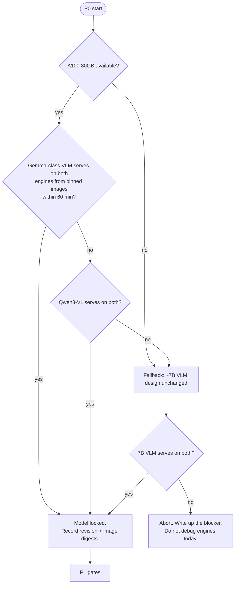

# P0 — Feasibility (0:00–1:30)

| | |
|---|---|
| **Objective** | Environment controlled, model locked, workloads built |
| **Entry** | Nothing — this is the start |
| **Exit** | GPU confirmed, clocks locked, images pinned, model chosen, `build.py` output on disk, per-image token count probed, fallback client exists |
| **Hard rule** | Do not debug engine support. Switch models and move on. |

## 0:00–0:30 — Hardware and model decision

**GPU: A100 80GB required.** A 30B-class model in bf16 is ~60 GB of weights
before KV. On 40 GB you are forced into int4, which is out of scope
([SPEC §4](../SPEC.md)). If only 40 GB is available, drop to a ~7B VLM and keep
the design identical — the caching question does not depend on model size.

Selection rule: whichever candidate serves cleanly on **both** engines from
pinned container images, in preference order Gemma-class (Google surface area)
then Qwen3-VL. The Gemma-class candidate is dense, Qwen3-VL-30B-A3B is MoE —
MoE is not load-bearing for a caching question, so architecture does not affect
selection.

Record: model revision, engine versions and image digests, driver + CUDA
version.

## Environment controls (once, now)

- `nvidia-smi -pm 1` and `-lgc <fixed clock>` — kills thermal drift across the
  3-hour matrix. Record the clock.
- Pin container image digests for both engines. No source builds, no pip
  resolution, all day.

## 0:30–1:30 — Weight download, with the dead time used

Weight pull for a 30B model takes most of this block. Two build tasks run in
parallel on the CPU:

### `workloads/build.py`

1. **Token-count probe first:** one request per engine with a candidate image;
   record the model's per-image token count. Everything below depends on it.
2. Fix one image resolution from the probe; compute `T`, and Partial reuse's
   `(E_min, E_max)` so measured cacheable fraction spans ≈30–80%
   ([SPEC §5](../SPEC.md)). Record the constants.
3. Pre-generate `N = ceil(max_rate × run_seconds) + warmup` unique noise images
   plus 1 shared image, all at the fixed resolution, written to disk once.
   Noise content is fine — ViT FLOPs are content-independent.
4. Pre-encode base64 into `workloads/<name>/requests.jsonl`, one folder per
   workload (Full reuse, Cold, Partial reuse, Single stream), creating each
   folder and its empty `results/` and `metrics/` subdirectories. At 16 req/s,
   encoding fresh images can bottleneck the **client**, which would show up as
   a fake engine regression.
5. Render each workload's README once, before any run, so the setup diagram is
   reviewable while the results table is still empty
   ([SPEC §8](../SPEC.md)).

### Fallback async client

A minimal aiohttp OpenAI-chat client: fixed request list in, per-request
timestamps out. Written now, used only if Gate C fails
([P1](P1-gates.md)) — and reused on day 2 for Mooncake replay if the native
path is blocked ([P6](P6-last-experiment.md)). Pre-writing it here is what
makes Gate C unable to stall the day.

## Exit checklist

- [ ] Clock locked and recorded; persistence mode on
- [ ] Model + engine images pinned, digests recorded
- [ ] Per-image token count probed and recorded
- [ ] `T`, `C`, `(E_min, E_max)` computed and recorded
- [ ] Four workload folders on disk, each with `requests.jsonl`, empty
      `results/` and `metrics/`, and a rendered README showing the setup
      diagram
- [ ] Fallback client runs against a dummy endpoint
