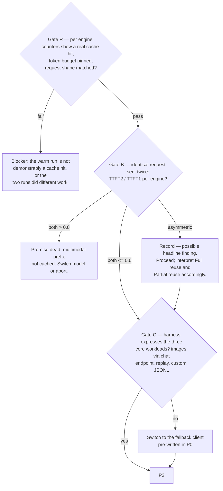

# P1 — Validation gates (1:30–2:30)

| | |
|---|---|
| **Objective** | Prove the measurement is valid before spending any runs on it |
| **Entry** | P0 exit: model locked, workloads built |
| **Exit** | Gates R, B, C passed (or resolved per fallback); config dumps committed |
| **Hard rule** | Gate R is blocking. Gate B blocks only if *both* engines fail. |

> **Amended after P1 was run — Gate A removed as a blocker.** The original Gate A
> required reused KV to produce byte-identical output to fresh prefill. Measured
> at 36 tokens it gave vLLM PASS / SGLang FAIL; re-measured at 512 tokens
> **both engines fail** (vLLM diverges at token 55, SGLang at token 21). Neither
> uses batch-invariant kernels by default, so the "pass" was only a statement
> about how far we happened to generate. More importantly the gate guarded the
> wrong property: this study's dependent variables are latencies, and no latency
> reads token values — TTFT is fixed at position 0, before any divergence can
> occur. Cross-engine output equivalence never held anyway, cold or warm.
> Gate A is replaced by **Gate R**, which checks the thing latency actually
> depends on. The divergence index is still recorded, as a diagnostic, not a
> gate. Full reasoning and numbers in [`LEARNINGS.md`](../../LEARNINGS.md).

## 1:30–2:00 — Servers up, config dumps

Bring up each engine once (serialized) and commit a config dump per engine:
block size, chunked-prefill setting, scheduler policy, `max_num_seqs`, memory
fraction, **reported KV-token capacity at startup**. Memory knobs pinned equal
across engines; scheduler knobs recorded, not equalized — the defaults differ
and are part of the system under test.

## 2:00–2:30 — The gates

The obvious check — cross-engine token identity at temperature 0 — is a trap.
Two engines with different kernels, batching, and reduction orders are **not**
expected to be token-identical, and numeric drift produces benign divergence.
Gating on it burns the morning on a non-bug. Cross-engine first-32-token
agreement is logged as informational only.

What actually validates the experiment is **within-engine** consistency:

### Gate R — the warm run is a real cache hit, doing matched work (blocking)

What a latency comparison actually depends on. Three conditions, checked
symmetrically on both engines:

1. **Genuine reuse, proven by mechanism rather than output.** The engine's own
   cached-token counters must increment *and* latency must drop. A run that is
   merely fast — because it landed in a smaller batch, say — is a real number
   mislabelled as a cache saving. This is a positive check, not an equivalence
   check. Per-request sources differ per engine and are pinned here, not
   assumed: vLLM exposes only `vllm:prefix_cache_{hits,queries}_total` on
   `/metrics` (diff them around each request, serially); SGLang needs
   `--enable-cache-report` and then returns `cached_tokens` in the non-streaming
   `usage` object.
2. **Token budget pinned identically.** This is the one way output divergence
   can bite a latency number sideways: if a divergent token happens to be a stop
   token, that run ends early and a 40-token run gets compared against a
   128-token one with the delta attributed to caching. Every timed request sends
   `max_tokens`, `min_tokens`, `ignore_eos: true` **and** `stop_token_ids: []`,
   as defence in depth against stop tokens a chat template adds beyond the
   tokenizer's `eos_token_id`. Do not trust the flags: **verify
   `completion_tokens == budget` from the server's `usage` block on every run.**
   Never infer generated length by re-tokenizing the decoded text — that does
   not round-trip, and doing so once produced a false report that vLLM was
   stopping short at 461/464 of a 512 budget when it had emitted exactly 512.
3. **Matched request shape.** Same prompt, same image token geometry, same batch
   context across the runs being compared.

**Recorded but not gating:** the token index at which the warm path first
diverges from the fresh path, per engine, at a stated generation length. It is a
continuous quantity, not a boolean — the probability of at least one divergence
grows with length, so "matches through 64" and "matches through 512" are
different grades. Report the index and the length together.

This gate cannot be loosened for any claim that reads output *content* — cache
transparency, unchanged outputs, generation quality. Such a claim needs
per-engine deterministic mode on both engines, which the pinned SGLang version
does not offer ([`LEARNINGS.md`](../../LEARNINGS.md) §5).

### Gate B — what does the multimodal path actually cache?

The double-send TTFT ratio is the one number that reveals it. KV reuse and
vision-encoder/embedding reuse are **separate cache layers** — an engine can
reuse KV yet re-run the vision tower, or cache embeddings but not KV. A partial
drop means exactly that, and it becomes part of the finding, not a failure.
Blocking only if *neither* engine engages.

While here: diff the cached-token counters across the two sends to pin each
engine's hit-rate semantics (per-token vs per-query — not comparable, and the
[SPEC §6](../SPEC.md) validity gates depend on knowing which is which).

### Gate C — harness capability

Verify `vllm bench serve --backend openai-chat` can: send images through the
chat endpoint, replay an identical image, and consume the custom JSONL from P0.
If not, the fallback client takes over — no new code written here.

## Exit checklist

- [ ] Config dumps for both engines committed, including whether each engine
      captured CUDA graphs and with which batch-size buckets — a decode-latency
      comparison across engines running different launch strategies measures the
      launch strategy ([`LEARNINGS.md`](../../LEARNINGS.md) §7)
- [ ] Gate R: per-request cached-token source working on both engines;
      `completion_tokens` equals the pinned budget on both
- [ ] Gate B: TTFT₂/TTFT₁ per engine recorded; hit-rate semantics pinned
- [ ] Gate C: harness (or fallback) demonstrated on all four JSONLs
- [ ] Divergence index recorded per engine, with its generation length
- [ ] Cross-engine informational diff logged
