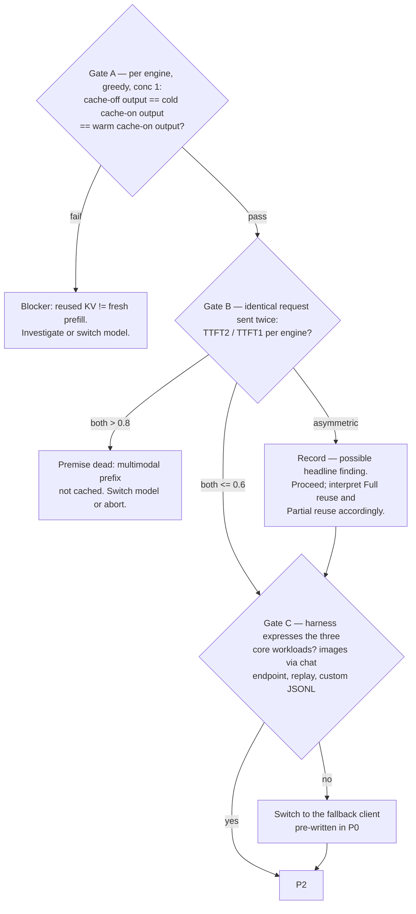

# P1 — Validation gates (1:30–2:30)

| | |
|---|---|
| **Objective** | Prove the measurement is valid before spending any runs on it |
| **Entry** | P0 exit: model locked, workloads built |
| **Exit** | Gates A–C passed (or resolved per fallback); config dumps committed |
| **Hard rule** | Gate A is blocking. Gate B blocks only if *both* engines fail. |

## 1:30–2:00 — Servers up, config dumps

Bring up each engine once (serialized) and commit a config dump per engine:
block size, chunked-prefill setting, scheduler policy, `max_num_seqs`, memory
fraction, **reported KV-token capacity at startup**. Memory knobs pinned equal
across engines; scheduler knobs recorded, not equalized — the defaults differ
and are part of the system under test.

## 2:00–2:30 — The gates

The obvious check — cross-engine token identity at temperature 0 — is a trap.
Two engines with different kernels, batching, and reduction orders are **not**
expected to be token-identical, and numeric drift produces benign divergence.
Gating on it burns the morning on a non-bug. Cross-engine first-32-token
agreement is logged as informational only.

What actually validates the experiment is **within-engine** consistency:

### Gate A — reused KV ≡ fresh prefill (blocking)

Three sends per engine: cache disabled ×1; restart with cache enabled ×2
(cold, then warm). All three outputs token-identical at greedy over 128 tokens.
This is the property the whole experiment rests on. If divergence appears only
deep in the tail, gate on the first 64 tokens and record.

### Gate B — what does the multimodal path actually cache?

The double-send TTFT ratio is the one number that reveals it. KV reuse and
vision-encoder/embedding reuse are **separate cache layers** — an engine can
reuse KV yet re-run the vision tower, or cache embeddings but not KV. A partial
drop means exactly that, and it becomes part of the finding, not a failure.
Blocking only if *neither* engine engages.

While here: diff the cached-token counters across the two sends to pin each
engine's hit-rate semantics (per-token vs per-query — not comparable, and the
[SPEC §6](../SPEC.md) validity gates depend on knowing which is which).

### Gate C — harness capability

Verify `vllm bench serve --backend openai-chat` can: send images through the
chat endpoint, replay an identical image, and consume the custom JSONL from P0.
If not, the fallback client takes over — no new code written here.

## Exit checklist

- [ ] Config dumps for both engines committed
- [ ] Gate A: 3-way identical output per engine, logged verbatim
- [ ] Gate B: TTFT₂/TTFT₁ per engine recorded; hit-rate semantics pinned
- [ ] Gate C: harness (or fallback) demonstrated on all four JSONLs
- [ ] Cross-engine informational diff logged
