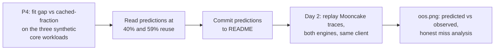

# P6 — The last experiment: real-workload replay

| | |
|---|---|
| **Objective** | External validity: does the synthetic model predict real traffic? |
| **Entry** | VisionArena replay: leftover P5 time, or first on day 2. Mooncake replay: day 2, and **only after the H7 prediction commit from [P4](P4-writeup.md) exists** |
| **Exit** | VisionArena replay: 2 runs tabled. Mooncake replay: 8 runs, `figures/oos.png`, miss analysis |
| **Hard rule** | Slip the VisionArena replay to day 2 before ever skipping the H7 prediction commit |

The synthetic matrix isolates mechanisms; it cannot say whether they matter in
production. These two workloads are the pre-registered epilogue.



## VisionArena replay — real multimodal content

Real LMArena user↔VLM traffic, natively supported by the day-1 harness:

```
vllm bench serve --backend openai-chat --endpoint /v1/chat/completions \
  --dataset-name hf --dataset-path lmarena-ai/VisionArena-Chat \
  --hf-split train --num-prompts 200 --seed 0 --disable-shuffle
```

- **Fixed seed + shuffle disabled** so both engines receive the identical
  request sequence; otherwise this is two different workloads, not one
  comparison.
- Outputs pinned (`max_tokens=128, ignore_eos`): this workload isolates real
  *input* structure — real images, real length variance. Output realism is the
  Mooncake replay's job.
- Sampled turns are independent conversations, so cross-request sharing ≈ 0 by
  construction. VisionArena replay is the **cold regime with real content** — a
  check that Cold parity survives real inputs, not a cache test. That is what
  H6 encodes.
- 2 runs at one rate from its own 2-min pilot (real image sizes shift the
  knee). ~20 min total.

## Mooncake replay — real prefix structure (day 2)

Kimi production traces: arrival timestamps, input/output lengths, and
`hash_ids` — cumulative 512-token block hashes, so identical IDs mean identical
prefixes. The cache-relevant structure survives anonymization by design. Two
traces: Conversation (~40% reuse) and Tool&Agent (~59%).

**Harness:** `sglang.bench_serving` has native Mooncake replay *and* drives
vLLM backends — one client for both engines, the mirror image of day 1:

```
python3 -m sglang.bench_serving --backend <sglang|vllm-chat> \
  --dataset-name mooncake --dataset-path traces/<trace>.jsonl \
  --mooncake-workload <conversation|agent> \
  --use-trace-timestamps true --mooncake-slowdown-factor <s>
```

**Day-2 pilot must verify two documented sharp edges before the matrix:**
1. Docs mark the mooncake dataset "sglang only" — confirm it runs against the
   `vllm-chat` backend, else fall back to the [P0](P0-feasibility.md) async
   client extended with trace timestamps.
2. A known failure mode where trace sessions exceed the context window
   (57k+ tokens observed against 16k limits).

### Protocol

- Pin the trace source (official kvcache-ai/Mooncake repo or its HF mirror);
  commit the files and their source hashes to
  `workloads/mooncake-replay/traces/`.
- First N=2,000 requests per trace; first 200 excluded as warmup.
- `--use-trace-timestamps` with two slowdown factors bracketing the knee from a
  10-min pilot. Real arrivals are bursty; preserving them is the point — this
  is the direct answer to the Poisson limitation stated in
  [P4](P4-writeup.md).
- Honor per-request output lengths from the trace, `ignore_eos` on:
  heavy-tailed outputs are part of the workload here, deliberately unlike the
  three synthetic core workloads.
- **Long-context guard:** set `max_model_len` to the model maximum and **drop**
  sessions that still exceed it, reporting the dropped fraction. Capping
  instead would silently rewrite the sharing structure being measured.
- Validity gate, same spirit as [SPEC §6](../SPEC.md): engine-reported
  cached-token fraction per trace must land near the trace's published reuse
  ratio. If Conversation does not read ≈40%, the replay reconstruction is
  broken and latencies are void.
- **Saturation gate, amended after P3 found the real matrix's shared `0.8κ`
  point collapsed for most workloads
  ([SPEC §3](../SPEC.md), [`../../learnings/measurement/ttft-growth-signal.md`](../../learnings/measurement/ttft-growth-signal.md)).**
  H7's prediction is read off gap.png at a *specific load regime* (stated in
  the P4 prediction commit — likely `0.5κ`-equivalent, the only rate that
  survived as clean). If the replay's preserved trace timestamps drive either
  engine toward or past its own knee, the observation is no longer in the
  regime the prediction assumes, and a miss is guaranteed for reasons that
  have nothing to do with whether the cache model is right. Compute each
  trace/slowdown/engine cell's own `ttft_growth_ratio`
  ([`../../scripts/client.py`](../../scripts/client.py)) alongside the
  existing cache-fraction check; a cell with `ttft_growth_ratio > 2.0` is
  flagged saturated the same way a synthetic cell is, and the miss analysis
  below must say so rather than reading a saturation artifact as a cache-model
  failure.
- Record `--mooncake-num-rounds` and all replay flags; they define the
  workload.
- Matrix: 2 traces × 2 slowdowns × 2 engines = **8 runs**, ~2–3 h with pilots.
- The Mooncake replay subsumes Cache thrash: an hour of real traffic against
  finite KV forces real eviction under a real working set.

### Deliverable

**`figures/oos.png`** — H7 predicted vs observed engine gap, four points
(2 traces × 2 loads) against the y=x diagonal, plus a miss analysis in the
README whichever way it lands. **The miss analysis must attribute any
divergence to one of two causes, not leave it ambiguous:** a genuine
cache-model failure (the synthetic gap-vs-fraction relationship doesn't
transfer to real traffic), or the saturation gate above firing (the replay
pushed a cell past its knee, so it was never testing the same regime the
prediction was made in). A synthetic benchmark that predicts a production
replay out of sample is a different class of artifact from either alone; a
predicted miss, analyzed honestly *and correctly attributed*, is the
second-best outcome — and still better than 30 more benchmark runs. A miss
that turns out to be a saturation artifact, mislabeled as a cache-model
failure, is worse than either.

## Exit checklist

- [ ] VisionArena replay: 2 runs, identical sample sequence verified, folder
      README regenerated
- [ ] H7 prediction commit hash referenced in the Mooncake replay run log
- [ ] Mooncake replay: 8 runs + pilots, validity gates checked per trace,
      `ttft_growth_ratio` checked per cell, folder README regenerated
- [ ] `oos.png` committed; H6/H7 verdicts filled in the top-level README
- [ ] Every miss attributed to cache-model failure or saturation-gate firing —
      none left ambiguous
