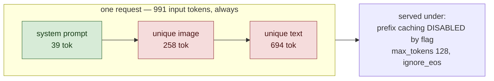

# Cold

<!-- Generated by scripts/render_readme.py — do not edit by hand. -->

Every request gets its own freshly generated noise image and its own text, and caching is switched off at the server flag as well. Nothing repeats and nothing can be skipped, so both engines do all the work every time. This is the control. If the engines differ here, the difference is not about caching at all, and every other result in the matrix has to be read in that light.

## Setup

Green segments are byte-identical across every request in this workload; red segments are unique to each request.

| Constant | Value |
|---|---|
| Input budget `T` | 991 tokens, identical across workloads |
| Image resolution | 448x448 |
| Requests built | 1940 (20 discarded as warmup) |
| Tokenizer | `google/gemma-4-31B-it` |

## Results

| Run | Engine | Rate (req/s) | p50 TTFT (ms) | p99 TTFT (ms) | p50 ITL (ms) | Completed / offered | Cached fraction | Tag |
|---|---|---|---|---|---|---|---|---|
| `cold_sglang_0.5k` | sglang | 0.63 | 1000 | 5376 | 49 | 200 / 200 | n/a | ok |
| `cold_sglang_0.8k` | sglang | 1.008 | 20632 | 48020 | 50 | 200 / 200 | n/a | saturated |
| `cold_sglang_1.2k` | sglang | 1.512 | 96169 | 185154 | 50 | 300 / 300 | n/a | saturated |
| `cold_vllm_0.5k` | vllm | 0.63 | 573 | 1289 | 47 | 200 / 200 | n/a | ok, jit_contaminated |
| `cold_vllm_0.8k` | vllm | 1.008 | 1058 | 10074 | 52 | 200 / 200 | n/a | saturated |
| `cold_vllm_1.2k` | vllm | 1.512 | 44037 | 80036 | 52 | 300 / 300 | n/a | saturated |

p50 is primary. At 200 requests p99 is the second-worst sample and is descriptive only.

## Validity

Measured cached-token fraction must read approximately 0.

| Run | Completion ≥ 95% | Cache gate | Verdict |
|---|---|---|---|
| `cold_sglang_0.5k` | yes | no scrape | not yet checkable |
| `cold_sglang_0.8k` | yes | no scrape | not yet checkable |
| `cold_sglang_1.2k` | yes | no scrape | not yet checkable |
| `cold_vllm_0.5k` | yes | no scrape | not yet checkable |
| `cold_vllm_0.8k` | yes | no scrape | not yet checkable |
| `cold_vllm_1.2k` | yes | no scrape | not yet checkable |

---

Design, hypotheses and thresholds: [`spec/SPEC.md`](../../spec/SPEC.md). Cross-workload figures and the H1–H7 verdicts live in the top-level README.
