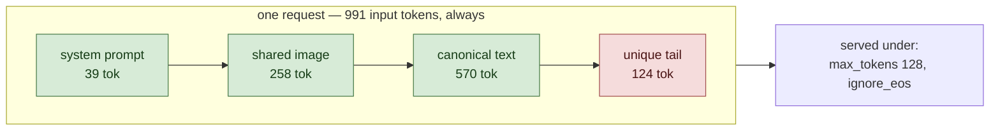

# Full reuse

<!-- Generated by scripts/render_readme.py — do not edit by hand. -->

Every request opens identically: the same system prompt, the same image, and the same block of text. Only a short unique tail at the end differs, so roughly seven eighths of each request is a repeat of the one before it. This is the best case a cache can ever have, and it answers a single question: when reuse fully works, does either engine pull ahead?

## Setup

Green segments are byte-identical across every request in this workload; red segments are unique to each request.

| Constant | Value |
|---|---|
| Input budget `T` | 991 tokens, identical across workloads |
| Image resolution | 448x448 |
| Requests built | 1940 (20 discarded as warmup) |
| Tokenizer | `google/gemma-4-31B-it` |

## Results

| Run | Engine | Rate (req/s) | p50 TTFT (ms) | p99 TTFT (ms) | p50 ITL (ms) | Completed / offered | Cached fraction | Tag |
|---|---|---|---|---|---|---|---|---|
| `p2_smoke_full-reuse_vllm` | vllm | 3.266 | 266 | 421 | 68 | 200 / 200 | 85.2% | ok |

p50 is primary. At 200 requests p99 is the second-worst sample and is descriptive only.

## Validity

Measured cached-token fraction must sit within ±5 points of the constructed 87.5% — not near 100%, the unique tail is real.

| Run | Completion ≥ 95% | Cache gate | Verdict |
|---|---|---|---|
| `p2_smoke_full-reuse_vllm` | yes | pass | ok |

---

Design, hypotheses and thresholds: [`spec/SPEC.md`](../../spec/SPEC.md). Cross-workload figures and the H1–H7 verdicts live in the top-level README.
