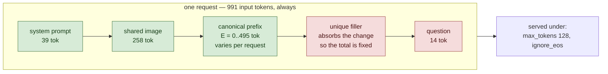

# Partial reuse

<!-- Generated by scripts/render_readme.py — do not edit by hand. -->

Every request opens with the same image and the same canonical text, but each one stops copying at a different, randomly chosen point and then goes its own way. One request might share 300 tokens and the next 780. This is the sharp probe: one engine tracks its cache in fixed 16-token chunks and has to discard a chunk a request diverges inside, the other tracks it token by token and does not. Randomising where requests split, rather than only what they say, is what stops both engines from getting conveniently aligned split points.

## Setup

Green segments are byte-identical across every request in this workload; red segments are unique to each request.

| Constant | Value |
|---|---|
| Input budget `T` | 991 tokens, identical across workloads |
| Image resolution | 448x448 |
| Requests built | 1940 (20 discarded as warmup) |
| Tokenizer | `google/gemma-4-31B-it` |

## Results

| Run | Engine | Rate (req/s) | p50 TTFT (ms) | p99 TTFT (ms) | p50 ITL (ms) | Completed / offered | Cached fraction | Tag |
|---|---|---|---|---|---|---|---|---|
| `partial-reuse_sglang_0.5k` | sglang | 1.134 | 561 | 2241 | 51 | 208 / 208 | n/a | ok |
| `partial-reuse_sglang_0.8k` | sglang | 1.814 | 22449 | 42617 | 56 | 372 / 372 | n/a | saturated |
| `partial-reuse_sglang_1.2k` | sglang | 2.722 | 90918 | 180224 | 56 | 602 / 602 | n/a | saturated |
| `partial-reuse_vllm_0.5k` | vllm | 1.134 | 329 | 652 | 50 | 208 / 208 | 53.0% | ok, jit_contaminated |
| `partial-reuse_vllm_0.8k` | vllm | 1.814 | 426 | 6070 | 59 | 372 / 372 | 52.3% | ok |
| `partial-reuse_vllm_1.2k` | vllm | 2.722 | 48892 | 104097 | 60 | 602 / 602 | 50.3% | saturated |

p50 is primary. At 200 requests p99 is the second-worst sample and is descriptive only.

## Validity

Measured cached-token fraction must land inside the constructed span 30.0%–79.9%.

| Run | Completion ≥ 95% | Cache gate | Verdict |
|---|---|---|---|
| `partial-reuse_sglang_0.5k` | yes | no scrape | not yet checkable |
| `partial-reuse_sglang_0.8k` | yes | no scrape | not yet checkable |
| `partial-reuse_sglang_1.2k` | yes | no scrape | not yet checkable |
| `partial-reuse_vllm_0.5k` | yes | pass | ok |
| `partial-reuse_vllm_0.8k` | yes | pass | ok |
| `partial-reuse_vllm_1.2k` | yes | pass | ok |

---

Design, hypotheses and thresholds: [`spec/SPEC.md`](../../spec/SPEC.md). Cross-workload figures and the H1–H7 verdicts live in the top-level README.
