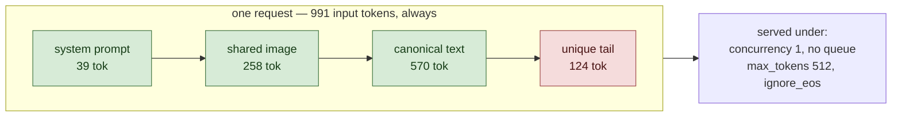

# Single stream

<!-- Generated by scripts/render_readme.py — do not edit by hand. -->

Full-reuse content, but one request at a time and longer answers. There is no queue, no batching and nothing to schedule, so the GPU is barely occupied. This isolates plain text-generation speed away from every caching question - the check that both engines generate at the same rate when nothing clever is happening.

## Setup

Green segments are byte-identical across every request in this workload; red segments are unique to each request.

| Constant | Value |
|---|---|
| Input budget `T` | 991 tokens, identical across workloads |
| Image resolution | 448x448 |
| Requests built | 1940 (20 discarded as warmup) |
| Tokenizer | `google/gemma-4-31B-it` |

## Results

_No runs yet._ This README was rendered before the matrix; the table fills in as each cell completes.

## Validity

No cache-fraction gate applies to this workload; completion rate is the only validity condition.

---

Design, hypotheses and thresholds: [`spec/SPEC.md`](../../spec/SPEC.md). Cross-workload figures and the H1–H7 verdicts live in the top-level README.
